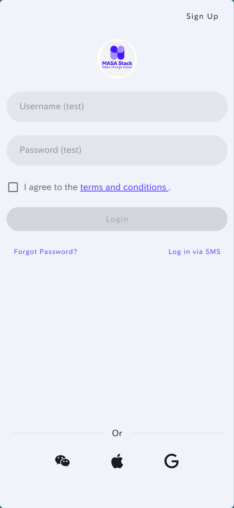
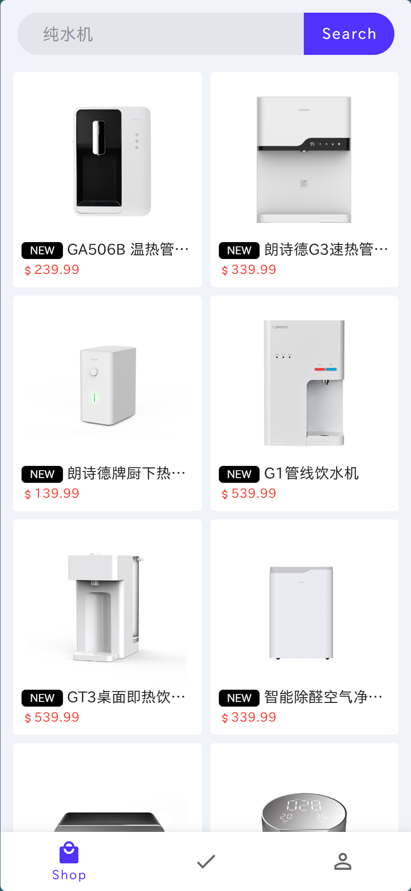
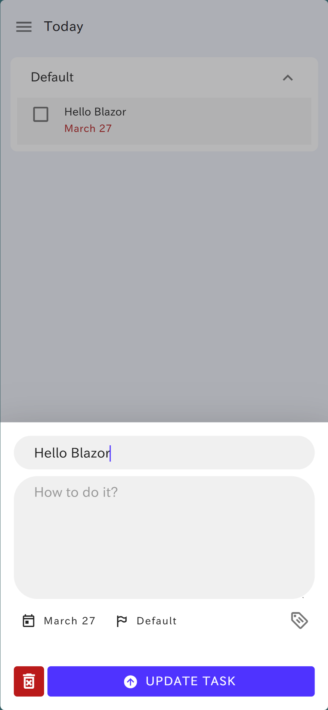

# MAUI hybrid with MASA Blazor Sample App

Provides a best practice example of how to integrate MAUI hybrid with MASA Blazor.

<table>
  <tr>
    <td></td>
    <td></td>
    <td></td>
    <td></td>
    <td></td>
    <td></td>
  </tr>
</table>